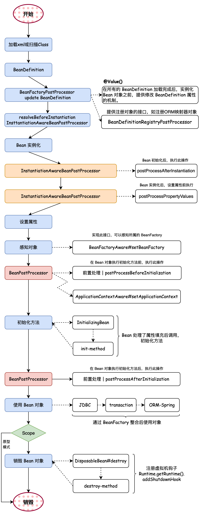

## 📢📢📢 学习说明

​		本仓库以 `Spring` 源码学习为目的，通过手写简化版 `Spring` 框架，了解 `Spring` 核心原理。关于过程中的笔记我放在了[博客](https://zzzicode.github.io/)中

​		在手写的过程中会简化 `Spring` 源码，摘取整体框架中的核心逻辑，简化代码实现过程，保留核心功能，例如：`IOC`、`AOP`、``Bean``生命周期、上下文、作用域、资源处理等内容实现。整个项目涉及到的``Bean``生命周期如下图所示：

## 📑📑📑 章节目录

​		下面提供一个仓库目录，针对每一章都有一个博客来详细介绍项目中新增的内容

- [x] 第一章：[实现一个简单的``Bean``容器](https://zzzicode.github.io/post/1.%E5%88%9B%E5%BB%BAspring%E5%AE%B9%E5%99%A8/)
- [x] 第二章：[将``Bean``的创建交给`IOC`容器](https://zzzicode.github.io/post/2.%E8%87%AA%E5%8A%A8%E5%88%9B%E5%BB%BAbean%E5%AF%B9%E8%B1%A1/)
- [x] 第三章：[实现带参的``Bean``创建](https://zzzicode.github.io/post/3.%E5%88%9B%E5%BB%BA%E5%B8%A6%E5%8F%82bean%E5%AF%B9%E8%B1%A1/)
- [x] 第四章：[将``Bean``的创建和属性填充分开](https://zzzicode.github.io/post/4.bean%E7%9A%84%E5%AE%9E%E4%BE%8B%E5%8C%96%E5%92%8C%E5%B1%9E%E6%80%A7%E5%A1%AB%E5%85%85%E5%88%86%E7%A6%BB/)
- [x] 第五章：[实现从配置文件中加载``Bean``的注册信息](https://zzzicode.github.io/post/5.%E5%B0%86bean%E7%9A%84%E6%B3%A8%E5%86%8C%E4%BF%A1%E6%81%AF%E6%94%BE%E5%85%A5%E9%85%8D%E7%BD%AE%E6%96%87%E4%BB%B6/)
- [x] 第六章：[实现应用上下文，后置处理器](https://zzzicode.github.io/post/6.%E5%BC%95%E5%85%A5applicationcontext%E5%92%8C%E5%90%8E%E7%BD%AE%E5%A4%84%E7%90%86%E5%99%A8/)
- [x] 第七章：[添加初始化和销毁模块](https://zzzicode.github.io/post/7.%E5%BC%95%E5%85%A5%E5%88%9D%E5%A7%8B%E5%8C%96%E5%92%8C%E9%94%80%E6%AF%81%E9%80%BB%E8%BE%91/)
- [x] 第八章：[`Aware`回调注入容器资源](https://zzzicode.github.io/post/8.%E4%BD%BF%E7%94%A8%E5%9B%9E%E8%B0%83%E6%9C%BA%E5%88%B6%E6%B3%A8%E5%85%A5%E8%B5%84%E6%BA%90/)
- [x] 第九章：[多种模式以及多种方式创建``Bean``对象](https://zzzicode.github.io/post/9.%E5%8E%9F%E5%9E%8Bbean%E5%92%8Cfactorybean/)
- [x] 第十章：[事件机制的实现](https://zzzicode.github.io/post/10.%E5%BC%95%E5%85%A5%E4%BA%8B%E4%BB%B6%E6%9C%BA%E5%88%B6/)
- [x] 第十一章：[引入`AOP`机制](https://zzzicode.github.io/post/11.%E5%9C%A8bean%E7%9A%84%E7%94%9F%E5%91%BD%E5%91%A8%E6%9C%9F%E4%B8%AD%E5%8A%A0%E5%85%A5aop/)
- [x] 第十二章：[自动扫描``Bean``对象以及属性占位符的使用](https://zzzicode.github.io/post/12.%E5%8C%85%E6%89%AB%E6%8F%8F%E5%92%8C%E5%B1%9E%E6%80%A7%E5%8D%A0%E4%BD%8D%E7%AC%A6/)
- [x] 第十三章：[通过注解给``Bean``注入依赖的属性](https://zzzicode.github.io/post/13.%E9%80%9A%E8%BF%87%E6%B3%A8%E8%A7%A3%E6%B3%A8%E5%85%A5%E5%B1%9E%E6%80%A7%E4%BF%A1%E6%81%AF/)
- [x] 第十四章：[通过延缓代理对象的创建时机从而给代理对象进行属性填充](https://zzzicode.github.io/post/14.%E7%BB%99%E4%BB%A3%E7%90%86%E5%AF%B9%E8%B1%A1%E7%9A%84%E5%B1%9E%E6%80%A7%E8%AE%BE%E7%BD%AE%E5%80%BC/)
- [x] 第十五章：[利用三级缓存解决循环依赖](https://zzzicode.github.io/post/15.%E4%B8%89%E7%BA%A7%E7%BC%93%E5%AD%98%E8%A7%A3%E5%86%B3%E5%BE%AA%E7%8E%AF%E4%BE%9D%E8%B5%96/)

## 🏁🏁🏁 总结

​		经过上面的填充，简化版 `Spring` 框架已经有了一定的规模，下面介绍在`Bean`的生命周期中都加入了哪些模块：

1. 首先`spring`框架需要读取`xml`配置文件，然后将配置的所有`Bean`的注册信息保存到`BeanDefinition`中
2. 之后就是触发实例化前的修改逻辑，内部可以将`Bean`中使用占位符形式填充的属性换成真正的属性值。
3. 下一步将实例化后的处理逻辑先保存到容器中，在实例化之后直接触发即可。
4. 然后需要初始化一个事件广播器并将其保存到`IOC`容器中，当事件发生时由事件广播器通知事件监听器从而执行对应的操作。
5. 之后就是事件监听器的实例化，将其保存到上一步中的事件广播器中，事件经过事件广播器的发布之后，对应的事件监听器就会得到通知
6. 然后进行所有`Bean`的第一次实例化，在这一步加入了类型转换的服务，内部保存了很多的类型转换器，之后就是实例化所有的`Bean`
7. 第一次实例化所有的`Bean`时，单例池中并没有需要的`Bean`，所以需要从头创建，首先创建一个空`Bean`，创建完成之后判断是不是`FactoryBean`类型的`Bean`，如果是的话需要从其中取出真正的`Bean`返回
8. 将创建的空`Bean`的信息保存到三级缓存中，便于后期出现循环依赖时使用，而循环依赖中会提前尝试`AOP`，从而得到`Bean`的原始对象或者代理对象。这也导致后面正常的`AOP`过程不一定会触发
9. 三级缓存中，每一级缓存的作用都不相同，大致区别如下：
   - 三级缓存：保存初始状态的未尝试代理的对象，用来**打破**循环依赖
   - 二级缓存：用来保存尝试过代理后的bean，保持bean的**单例性**
   - 一级缓存：保存实例化完成之后的bean便于复用，这里的bean已经是**完成**态

10. 然后就是属性填充，有两种属性填充的方式，首先进行注解属性填充
11. 然后进行普通的`xml`文件配置的属性填充
12. 之后使用`Aware`回调机制实现容器资源的注入
13. 之后执行初始化前的逻辑，主要是执行应用上下文的容器资源注入
14. 初始化执行逻辑中主要是执行初始化方法，初始化方法有两种方式，一种实现对应的接口，一种是在`xml`文件中配置指定初始化方法的名称
15. 初始化后的逻辑中进行正常`AOP`的操作，由于前面可能对`Bean`进行提前`AOP`，这里不一定触发
16. 之后就是将销毁方法注册到钩子函数中，在容器销毁之前进行调用
17. 经历上面的步骤之后，`Bean`创建完成，之后将单例`Bean`保存到单例池中
18. 后期再使用时走到第7步时就先尝试从单例池中拿，拿不到才会重新创建

​		以上的步骤只是精简过后描述的`Bean`的生命周期，细节需要查看提供的代码，代码在开发过程中参考了[小傅哥](https://bugstack.cn/)的文章，从文章中受益匪浅。